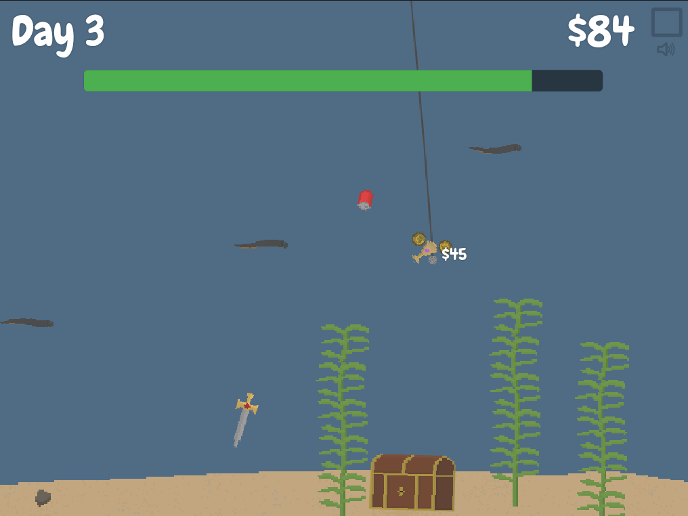

# Ludum Dare 58

My entry for Ludum Dare 58, built with TypeScript and my [custom game engine](https://github.com/tomaisthorpe/tedengine).

Dive deep to collect underwater treasures and upgrade your equipment with the goal of retrieving the ultimate treasure chest!


[Play the game here](https://l58.ted.tomaisthorpe.com/) | [Ludum Dare submission](https://ldjam.com/events/ludum-dare/58/underwater-salvage)



## Controls

- **WASD/Arrows** to move your magnet
- **Space** to start the day

## Development

```bash
npm run dev
```
